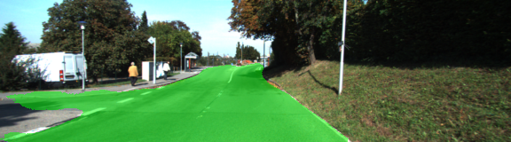
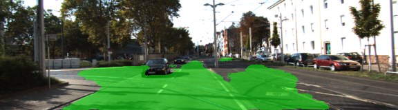
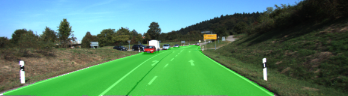
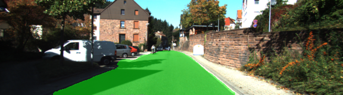
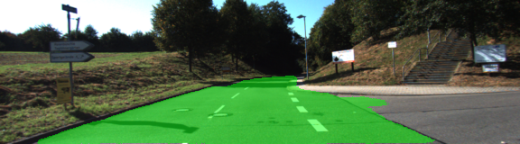
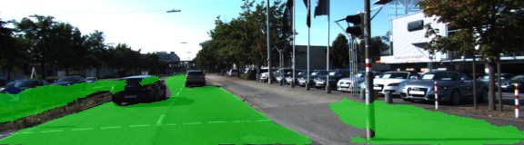

# Semantic Segmentation

## Introduction

The goal of this project is to label the pixels of a road in images using a Fully Convolutional Network (FCN).

The project is based FCN8 which uses VGG16 as encoder, and layers 3, 4 and 7 of VGG16 are utilized in creating skip layers for a fully convolutional network. The reasons for this are contained in the paper [Fully Convolutional Networks for Semantic Segmentation](https://arxiv.org/pdf/1605.06211.pdf).

In section 4.3, and further under header "Skip Architectures for Segmentation" and Figure 3, they note these provided for 8x, 16x and 32x upsampling, respectively. Using each of these in their FCN-8s was the most effective architecture they found.  

## Optimizer

The loss function for the network was `cross-entropy`, and `tf.train.AdamOptimizer` was used.

```py
def optimize(nn_last_layer, correct_label, learning_rate, num_classes):
 
    logits = tf.reshape(nn_last_layer, (-1, num_classes))
    correct_label_reshaped = tf.reshape(correct_label, (-1, num_classes))

    cross_entropy_loss = tf.reduce_mean(tf.nn.softmax_cross_entropy_with_logits(
                                    logits=logits, 
                                    labels=correct_label_reshaped))
    optimizer = tf.train.AdamOptimizer(learning_rate=learning_rate)
    train_op = optimizer.minimize(cross_entropy_loss)

    return logits, train_op, cross_entropy_loss
    
tests.test_optimize(optimize)

```

## Training

The hyperparameters used for the training are:

- keep_prob = 0.5
- learning_rate = 0.0009
- epochs = 50
- batch_size = 5

```py

def train_nn(sess, epochs, batch_size, get_batches_fn, train_op, cross_entropy_loss, input_image,
             correct_label, keep_prob, learning_rate):

    sess.run(tf.global_variables_initializer())

    for i in range(epochs):
        print('Epoch {} ...'.format(i + 1))
        for image, label in get_batches_fn(batch_size):
            _, loss = sess.run([train_op, cross_entropy_loss],
                                feed_dict={input_image: image,
                                            correct_label: label,
                                            keep_prob: 0.5,
                                            learning_rate: 0.0009})
            print('Loss: {:.3f}'.format(loss))
tests.test_train_nn(train_nn)

```

## Result

Here are a few sample images from the output of the solution, with the segmentation class overlaid with green on an original image.













## Additional Challenges

TBD

## Conclusion
TBD

## Reference

1. Fully Convolutional Networks for Semantic Segmentation ([Link](https://arxiv.org/pdf/1605.06211.pdf))
2. A 2017 Guide to Semantic Segmentation with Deep Learning ([Link](http://blog.qure.ai/notes/semantic-segmentation-deep-learning-review))